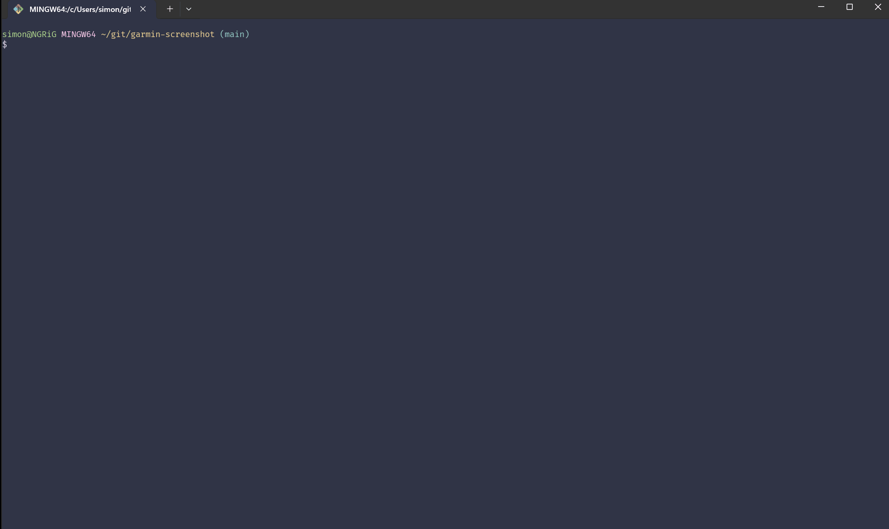

# Garmin Screenshot

Build your project for all configured devices, fire it up in the Connect IQ
Simulator and take a screenshot.

> [!NOTE]  
> I only do Garmin development under Windows so this isn't tested for macOS or
> Linux. Any contributions ensuring this would work on other OSes would be much
> appreciated!



## Prerequisites

-   [Connect IQ SDK]
-   [Python] (with [`poetry`][poetry])

## Usage

Ensure you have Python and `poetry` installed and run:

```sh
poetry run garmin-screenshot --help
```

## What does it do?

It's very simple, the tool works by

-   Parsing your `manifest.xml` to find all supported devices
-   Starts the simulator
-   Builds the project for each device
    ```sh
    monkeyc \
      -d <device-name> \
      -f <jungle-file> \
      -o <output-prg> \
      -y <developer-key>
    ```
-   Runs the build in the simulator
    ```sh
    monkeydo <output-prg> <device-name>
    ```

[Connect IQ SDK]: https://developer.garmin.com/connect-iq/sdk/
[Python]: https://www.python.org/
[poetry]: https://python-poetry.org/
